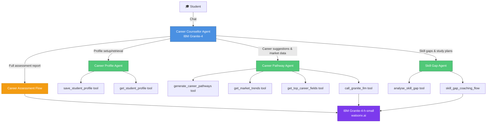
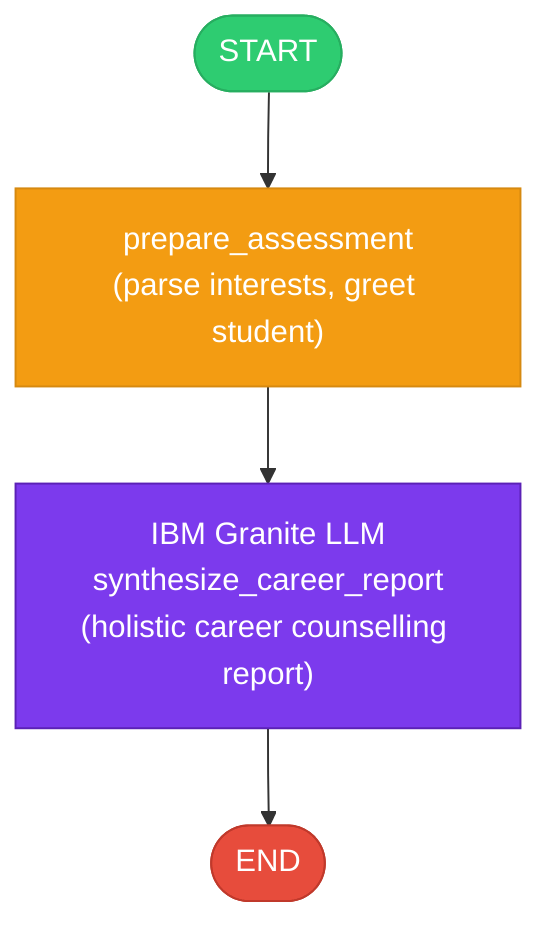
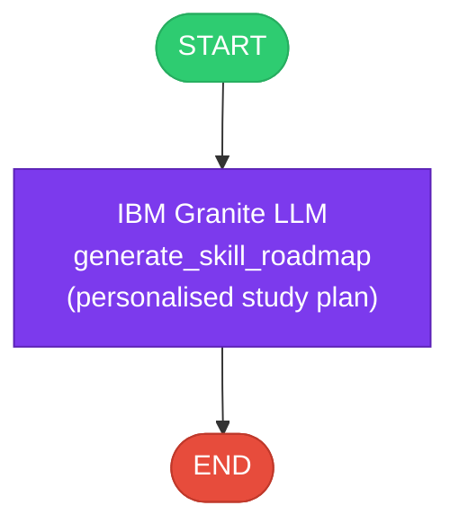
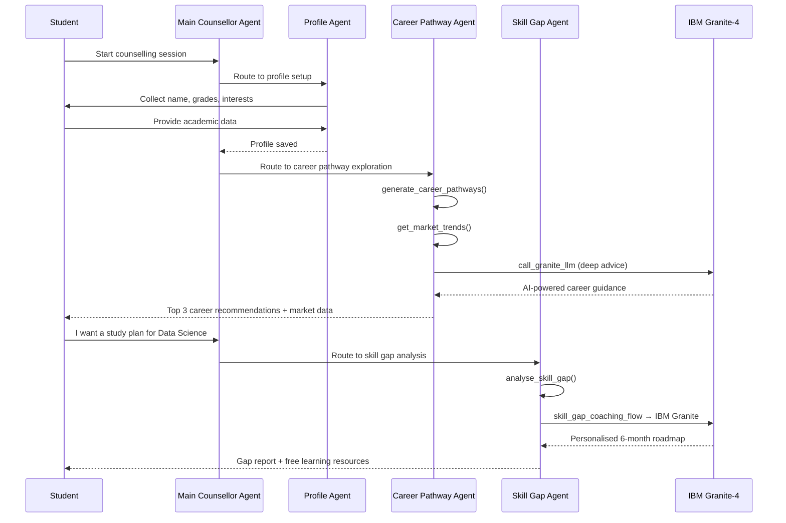

# Agentic Career Counselling Companion

> **Powered by IBM Granite AI on watsonx.ai** | Built with IBM watsonx Orchestrate ADK

---

## Overview

The **Agentic Career Counselling Companion** is an intelligent, autonomous multi-agent system that helps students make confident, future-ready career decisions. It continuously analyses academic performance, evolving interests, and real-time labor market trends to deliver tailored career pathway suggestions — with minimal dependency on manual intervention.

### The Challenge

Students often struggle to make informed career decisions due to:
- Fragmented access to guidance
- Limited self-awareness of academic strengths
- Rapidly evolving industry landscapes
- Traditional counselling methods lacking personalisation and scalability

### The Solution

An intelligent agent that:
- 🎓 **Profiles** students' academic performance and interests
- 🗺️ **Maps** strengths to best-fit career pathways
- 📊 **Monitors** real-time labor market trends (demand, salary, growth)
- 🔍 **Analyses** skill gaps against target career requirements
- 📚 **Generates** personalised study roadmaps with free resources
- 🤖 **Powers** all advice with IBM Granite-4 language model

---

## Architecture Diagram



---

## Workflow Diagrams

### 1. Career Assessment Flow



### 2. Skill Gap Coaching Flow



### 3. Full Counselling Journey



---

## Project Structure

```
career_counsellor/
├── __init__.py
├── import-all.sh                         # CLI import script
├── agents/
│   ├── career_counsellor_agent.yaml      # Main orchestrator agent
│   ├── career_profile_agent.yaml         # Student profile sub-agent
│   ├── career_pathway_agent.yaml         # Career pathway sub-agent
│   └── skill_gap_agent.yaml              # Skill gap & coaching sub-agent
├── tools/
│   ├── __init__.py
│   ├── granite_llm_tool.py               # IBM Granite-4 API tool
│   ├── student_profile_tool.py           # Student data CRUD tools
│   ├── market_trends_tool.py             # Labor market intelligence tools
│   ├── career_pathway_tool.py            # Career pathway recommendation tool
│   ├── skill_gap_tool.py                 # Skill gap analysis tool
│   ├── career_assessment_flow.py         # End-to-end assessment flow
│   └── skill_gap_coaching_flow.py        # Skill coaching flow
└── generated/                            # Compiled flow specs (auto-generated)

main_flow.py                              # Programmatic test runner
```

---

## Components

### Agents

| Agent | Role | Key Tools |
|-------|------|-----------|
| `career_counsellor_agent` | Main orchestrator — routes to sub-agents | `career_assessment_flow`, `call_granite_llm` |
| `career_profile_agent` | Collects & stores student academic profiles | `save_student_profile`, `get_student_profile` |
| `career_pathway_agent` | Generates career recommendations + market data | `generate_career_pathways`, `get_market_trends`, `call_granite_llm` |
| `skill_gap_agent` | Analyses skill gaps & generates study roadmaps | `analyse_skill_gap`, `skill_gap_coaching_flow` |

### Tools

| Tool | Description |
|------|-------------|
| `call_granite_llm` | Calls IBM Granite-4-h-small on watsonx.ai for open-ended advice |
| `save_student_profile` | Persists student academic data (subjects, scores, interests) |
| `get_student_profile` | Retrieves a saved student profile |
| `generate_career_pathways` | Matches student profile to top career fields with rationale |
| `get_market_trends` | Returns demand, salary, growth data for a career field |
| `get_top_career_fields` | Lists top N career fields ranked by market demand |
| `analyse_skill_gap` | Compares current skills vs. required skills for a target career |

### Flows

| Flow | Description |
|------|-------------|
| `career_assessment_flow` | Full end-to-end counselling session using IBM Granite |
| `skill_gap_coaching_flow` | Generates a personalised month-by-month study roadmap via Granite |

---

## IBM Technology Used

| Technology | Purpose |
|-----------|---------|
| **IBM Granite-4-h-small** | Core LLM for career advice, roadmap generation, holistic reports |
| **IBM watsonx.ai** | Model hosting at `us-south.ml.cloud.ibm.com` |
| **IBM watsonx Orchestrate** | Multi-agent orchestration, flows, and tool management |
| **IBM watsonx Orchestrate ADK** | Agent development framework |

---

## Setup & Usage

### Prerequisites

```bash
pip install ibm-watsonx-orchestrate
orchestrate env activate local   # or your target environment
```

### Set Environment Variable

```bash
export IBM_API_KEY="JFgzcUApwzdyD9TWf1UfYhH2dqyfbIcd-ij6uRHVS392-"
```

### Import Everything

```bash
chmod +x career_counsellor/import-all.sh
./career_counsellor/import-all.sh
```

### Start Chatting

```bash
orchestrate chat start
# Select: career_counsellor_agent
```

### Programmatic Testing

```bash
export PYTHONPATH=/path/to/adk/src:/path/to/adk
python3 main_flow.py
```

---

## Example Conversations

### 1. New Student — Full Assessment
```
Student: I want career counselling. I'm in 11th grade.
Agent:   Welcome! Let me set up your profile first. What subjects do you take?
Student: Mathematics (92%), Computer Science (88%), Physics (80%)
Agent:   Great scores! What are your interests?
Student: I love coding and problem-solving.
Agent:   Based on your profile, I recommend:
         1. Artificial Intelligence (match score: 5.8) — High demand, $110K–$180K
         2. Data Science (match score: 4.6) — Very high demand, $95K–$160K
         3. Cloud Computing (match score: 3.2) — Very high demand, $90K–$150K
```

### 2. Skill Gap Check
```
Student: I know Python and Statistics. Am I ready for Data Science?
Agent:   You have 2/8 required skills (25% readiness).
         ✅ You have: Python, Statistics
         ❌ You still need: SQL, Data Visualisation, Machine Learning Basics...
         📚 Priority: Start with SQL (Mode Analytics, free), 
            then Data Visualisation (Tableau Public, free)
         🗺️ With 10 hrs/week, you can be job-ready in ~6 months!
```

---

## Career Fields Covered

- 🤖 Artificial Intelligence
- 📊 Data Science
- 🔐 Cybersecurity
- ☁️ Cloud Computing
- 🏥 Healthcare
- 🎨 UX Design
- 💰 Finance
- 🌱 Renewable Energy

---

## License

Built for the IBM watsonx Hackathon using IBM Cloud Lite services and IBM Granite AI.
